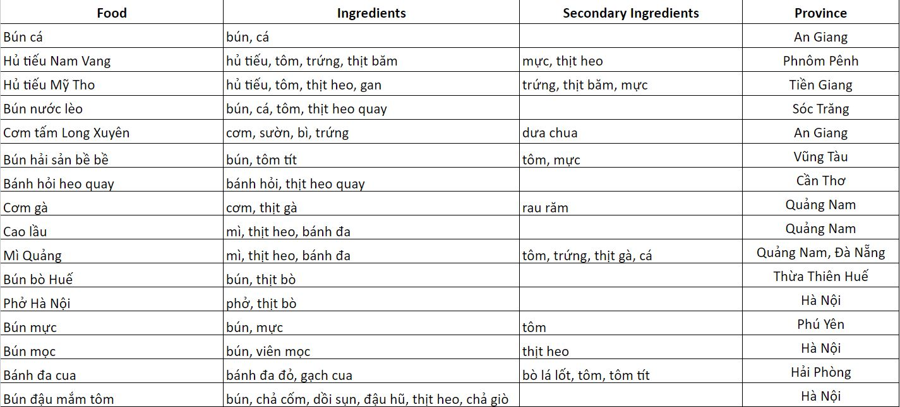
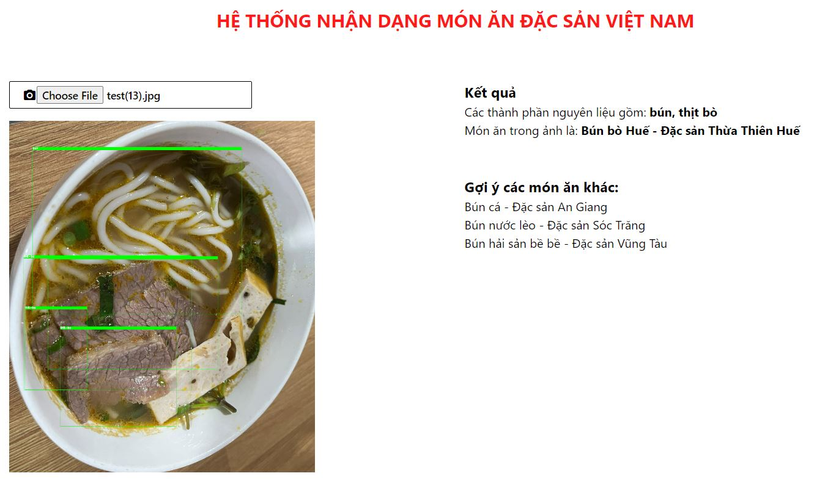
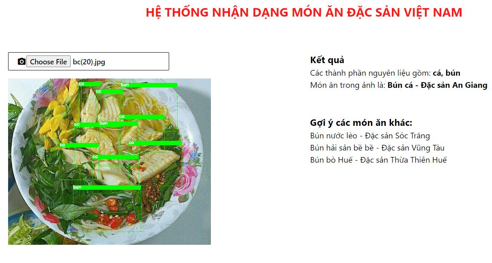
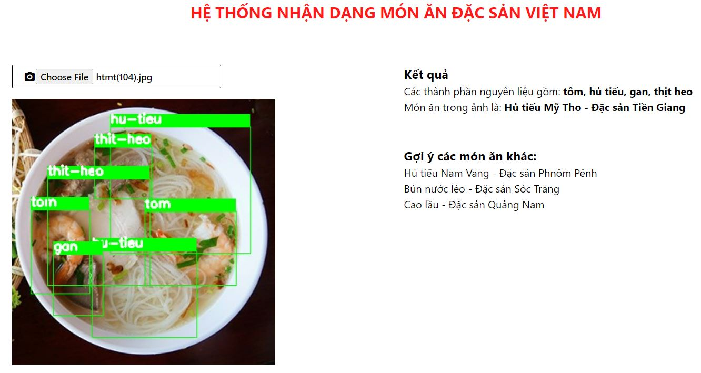

# Xây dựng hệ thống nhận dạng món ăn đặc sản Việt Nam

Bài toán object detection là một trong những bài toán của lĩnh vực thị giác máy tính và trí tuệ nhân tạo. Nhiệm vụ chính của object detection là phát hiện và xác định vị trí của các đối tượng trong ảnh hoặc video.

Cụ thể, trong bài toán này, một hệ thống phải nhận diện và vẽ ra các khung (bounding boxes) xung quanh các đối tượng trong hình ảnh, đồng thời phân loại chúng thành các lớp đã được định nghĩa trước.

Project này sẽ xây dựng một mô hình máy học có khả năng nhận dạng được các thành phần nguyên liệu xuất hiện trong hình ảnh của món ăn. Từ danh sách các nguyên liệu được nhận dạng có thể đưa ra dự đoán món ăn trong ảnh là món gì.

**Link dataset:** https://mega.nz/folder/Ne81mCqR#2fcJjE-sN-zVud0ssOAAdA

## YOLO:
YOLO, viết tắt của "You Only Look Once", là một trong những mô hình quan trọng và phổ biến trong lĩnh vực object detection. YOLO tiêu biểu cho sự tiến bộ của deep learning trong việc giải quyết bài toán object detection một cách hiệu quả và nhanh chóng.

Một trong những ưu điểm lớn của YOLO so với các phương pháp truyền thống là tốc độ xử lý nhanh, vì nó có thể dự đoán tất cả các bounding boxes trong một lần chạy. Điều này làm cho YOLO rất phù hợp cho các ứng dụng thời gian thực.

## Các bước thực hiện dự án:
1. Chuẩn bị dataset để huấn luyện mô hình YOLO. Ảnh của các món ăn được download từ Google Image và ảnh chụp thực tế. Dữ liệu được gán nhãn bằng LabelImg.

[Hướng dẫn download và install LabelImg](https://thigiacmaytinh.com/su-dung-tool-labelimg-de-danh-nhan-vat-the-trong-hinh/)

2. Chia dữ liệu ra làm 3 phần: **train, valid, test.**
3. Huấn luyện mô hình YOLO. Phiên bản được sử dụng là Yolov8.
4. Kiểm tra độ chính xác của mô hình bằng cách dự đoán phần tử mới.
5. Một món ăn sẽ được chia gồm hai thành phần: **Nguyên liệu chính** và **Nguyên liệu phụ**. Danh sách các nguyên liệu chính và phụ sẽ được dùng xem như **Bộ luật** để dự đoán món ăn. Mô hình Yolo sẽ phát hiện đồng thời dự đoán nhãn cho các đối tượng nguyên liệu trong ảnh. Danh sách các nhãn này sẽ được so sánh với **Bộ luật** để đưa ra dự đoán tên của món ăn.
Ảnh bộ luật:

6. Triển khai mô hình thành web service. Xây dựng ứng dụng web với Backend là **Flask** và Frontend là **Vuejs, thư viện UI Vuetify.**

## Kết quả Demo:

## Hướng phát triển của dự án:
1. Huấn luyện thêm mô hình CNN để phân lớp lại (xác thực) nhãn mà Yolo đã detect dược.
2. **Belief merge**, hay **hợp nhất niềm tin**, là một kỹ thuật trong trí tuệ nhân tạo được sử dụng để kết hợp thông tin từ nhiều nguồn khác nhau. Bài toán của chúng ta sẽ huấn luyện thêm các mô hình object detection khác (ngoài Yolo). Các mô hình này cũng sẽ đưa ra dự đoán về nguyên liệu trong ảnh món ăn. Kết hợp các thông tin từ **các mô hình object detection** này giúp đưa ra dự đoán về món ăn chính xác hơn.